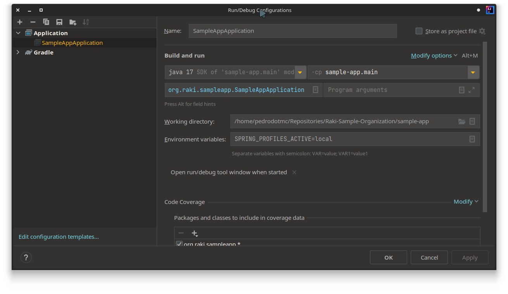

# Sample App

## How to run the app locally

1. Spin up a Postgres container

```bash
docker-compose up postgres
```

2. Run the project:

```bash
SPRING_PROFILES_ACTIVE=test gradle clean bootRun
```

Or if you use IntelliJ, create a profile as follows:



## How to run the app using `docker-compose`

1. Spin up postgres container:

```bash
docker-compose up postgres
```

2. In another terminal, generate jooq source code:

```bash
gradle generateJooq
```

3. Run the application container:

```bash
# Run application container:
docker-compose up --build sample-app

# Or run both containers in the same terminal:
docker-compose up --build --force-recreate
```
